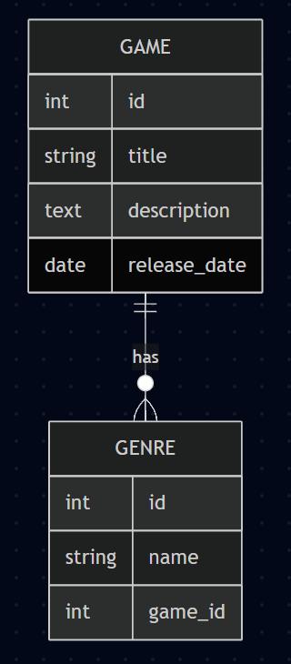
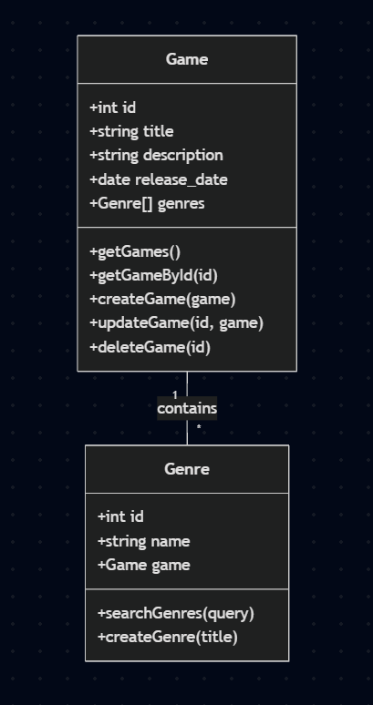
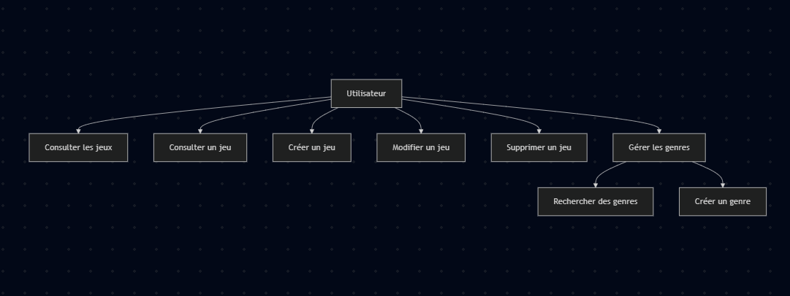
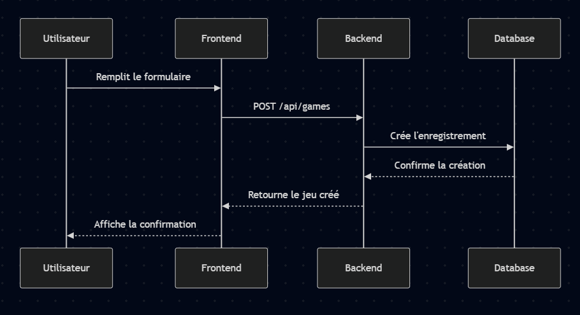

# Strapi CMS + Frontend

## Prérequis

-   Windows 11
-   Node.js 22.15.1
-   npm (inclus avec Node.js)
-   Git

## Installation

1. Cloner le repository

```bash
git clone https://github.com/mhommet/StrapiCMSTest.git
cd StrapiCMSTest
```

2. Installer les dépendances du backend

```bash
cd backend
npm install
npm rebuild
```

3. Installer les dépendances du frontend

```bash
cd ../frontend
npm install
```

## Démarrage

1. Démarrer le backend Strapi

```bash
cd backend
npm run dev
```

2. Dans un nouveau terminal, démarrer le frontend

```bash
cd frontend
npm run dev
```

## Accès aux applications

-   Frontend: http://localhost:5173
-   Strapi CMS: http://localhost:1338/admin

## Configuration de Strapi

1. Après l'installation, créez un nouveau compte administrateur Strapi en accédant à http://localhost:1338/admin

Vous pouvez utiliser ces identifiants par exemple :

-   Email: admin@test.fr
-   Mot de passe: Test1234!

2. Configurez les permissions :
    - Allez dans le Settings -> "Users & Permissions Plugin" -> "Roles"
    - Pour les collections "Game" et "Genre", cochez toutes les permissions (find, findOne, create, update, delete)
    - Ne pas oublier de cliquer sur SAVE en haut à droite

## Structure du projet

-   `/backend`: Application Strapi CMS
-   `/frontend`: Application React avec Vite

## Schéma Relationnel



## Diagramme de Classes



## Diagramme de Cas d'Utilisation



## Diagramme de Séquence (Création d'un jeu)



## Routes API

### Jeux (Games)

-   `GET /api/games` - Liste tous les jeux
-   `GET /api/games/:id` - Récupère un jeu spécifique
-   `POST /api/games` - Crée un nouveau jeu
-   `PUT /api/games/:id` - Met à jour un jeu existant
-   `DELETE /api/games/:id` - Supprime un jeu

### Genres

-   `GET /api/genres` - Liste tous les genres
-   `GET /api/genres/:id` - Récupère un genre spécifique
-   `POST /api/genres` - Crée un nouveau genre
-   `PUT /api/genres/:id` - Met à jour un genre existant
-   `DELETE /api/genres/:id` - Supprime un genre
